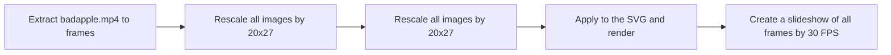

## bad apple, but on answer sheet
*seriously?*

From this [video](https://youtu.be/FatVbGjDuHg). This is a NodeJS program that turn bad apple into answer sheet frame by frame.

### Programs Required
- nodejs and npm
- ffmpeg

### Running the program
You can simply run the `do.sh` or `do.bat` if you're on Windows.

### How it works
You can simply run the `do.sh` or `do.bat` if you're on Windows.

